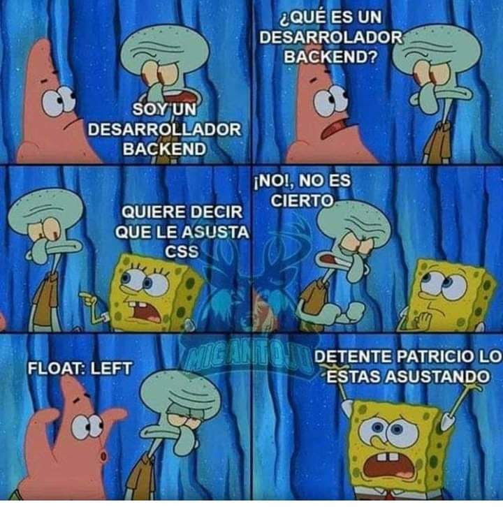

# Read Me Markdown

## Header 2

### Header 3

Cuerpo de texto normal para contenido

para **resaltar** en negritas.

Y para enfatizar o marcar con cursivas términos especiales *itálicas o cursivas*. 

Para citar 

> cita de referencia  para marcarlos 

Si quiero agregar código, utilizo las comillas simples

`code: var number = 5
var name = "Vania" 

function desayunar () {
} `

---

1. Hola
2. Hola 2
3. Hola 3

- Lista con viñetas
- Lista desordenada 
- Lista sin números
---

---
[Título del Link: Wikipedia](https://es.wikipedia.org/wiki/Wikipedia:Portada)

Ahora para agregar imágenes

agregar otra imagen:
